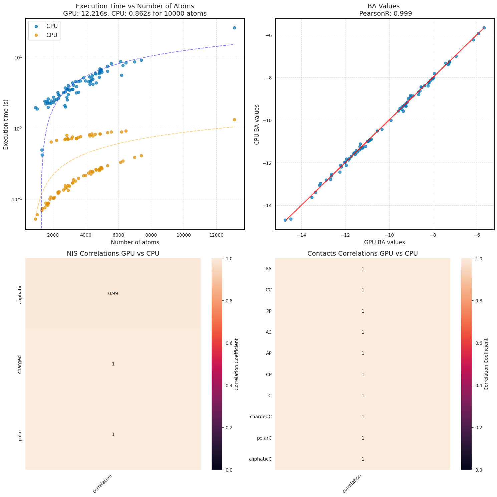
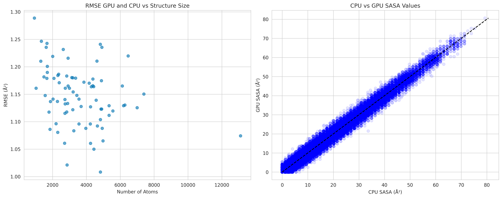

# Bio-Lib

A Python library for analyzing protein interactions, calculating Solvent Accessible Surface Area (SASA), predicting binding affinity (prodigy), and identifying residue contacts in JAX.

## Installation

```bash
python3 -m pip install --index-url https://test.pypi.org/simple/ --extra-index-url https://pypi.org/simple/ bio_lib==1.5.1
```

## Core Features 
- **Jax and CPU version of Prodigy**
- **Input Processing with AlphaFold2 Protein embeeding**
  - **Residue Classification**: Amino acid categorization (charged, polar, aliphatic) etc.
- **Binding Affinity Prediction in JAX**: ΔG and Kd estimation using interface contacts and surface properties, customized [PRODIGY](https://github.com/haddocking/prodigy):
  - **SASA Calculation**: JAX-based implementation of Shrake-Rupley algorithm for solvent-accessible surface area calculation (spehe points generated by golden spiral or precomputed sphere from thomson problem). Tested on M1 (batch calculation) and A100 (fully vectorized, a lot of memory needed)
  - **Contact Analysis**: Distance-based residue-residue contact determination within protein complexes

## Comparison with Original Prodigy Results

```bash
run-prodigy-custom PRODIGYdataset/ --use-jax # otherwise default is cpu version
```

### Tested on a A100 GPU in Colab (run-prodigy-custom --use-jax)



### SASA Values comparisons between freesasa (cpu version) and jax version (1000 Poitns)


## Usage Example

```python
# Process single structure
import jax
jax.config.update("jax_enable_x64", True)
from bio_lib.run_prodigy_custom import run
from pathlib import Path

folder = Path("PRODIGYdataset") # folder or file_path with pdb files

res = run(folder, output_dir=Path("results_cpu"), sphere_points=100, quiet=True, use_jax=True)
```
