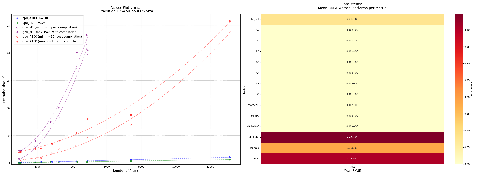

# Bio-Lib

A Python library for analyzing protein interactions, calculating Solvent Accessible Surface Area (SASA), predicting binding affinity (PRODIGY), and identifying & classifying residue contacts in JAX.

## Installation

```bash
python3 -m pip install --index-url https://test.pypi.org/simple/ --extra-index-url https://pypi.org/simple/ bio_lib
```

## Core Features 
- **JAX Implementation of PRODIGY**: GPU-accelerated version of the [PRODIGY](https://github.com/haddocking/prodigy) binding affinity predictor
- **Protein Structure Analysis**:
  - **Residue Classification**: Categorization of amino acids (charged, polar, aliphatic, etc.)
  - **Contact Analysis**: Distance-based detection of residue-residue contacts within protein complexes
- **Binding Affinity Prediction**:
  - Calculation of ΔG and Kd using interacting and non-interacting surfaces
  - Results correlate with >0.99 accuracy to the original PRODIGY implementation
  - Consistent predictions across different platforms
- **SASA Calculation**:
  - JAX-based implementation of the Shrake-Rupley algorithm
  - Supports sphere points generated by golden spiral or Thomson problem
  - Two execution modes:
    - Batch calculation (for M1 GPUs)
    - Fully vectorized (optimized for A100 GPUs, requires more memory)

## Use Cases
- Protein design using AlphaFold backpropagation (see example notebook)
- Binding affinity prediction for protein complexes
- Surface area analysis of protein structures

## Dependencies
- [AlphaFold2](https://github.com/deepmind/alphafold): Protein embedding functionality
- [PRODIGY](https://github.com/haddocking/prodigy): Original binding affinity prediction model -> transalated and vectorized in jax
- [FreeSASA](https://freesasa.github.io/): CPU-based SASA calculations (JAX version uses custom implementation) -> In Jax we use a own implemantion of the Shrake-Rupley SASA calculation vectorized in jax (this is the slowest part of the code)

## Limitations
- Maximum of 6000 atoms for M1 GPU calculations
- SASA calculation has ~25% overhead compilation time
- Higher memory requirements for fully vectorized mode

## Usage

### Python API
```python
import jax
from bio_lib.run_prodigy_custom import run
from pathlib import Path

# Download PRODIGY dataset from https://github.com/haddocking/PRODIGY
folder = Path("/content/PRODIGYdataset/")

# CPU version
res = run(folder, output_dir=Path("results_cpu_benchmark"), 
         sphere_points=100, quiet=True, use_jax=False, benchmark=True)

# GPU version
res = run(folder, output_dir=Path("results_gpu_benchmark"), 
         sphere_points=100, quiet=True, use_jax=True, benchmark=True)
```

### Command Line Interface
```bash
# Run on multiple PDB files
run-prodigy-custom PRODIGYdataset/ --use-jax

# For more options
run-prodigy-custom --help
```

## Performance

### GPU Benchmarks
Tested on A100 and M1 GPUs (including compilation time):


### SASA Accuracy
Comparison between FreeSASA (CPU) and JAX version (1000 points):
- Pearson correlation: 0.99
- Mean difference per atom: 0.59 Ų (across 78 benchmark structures)

