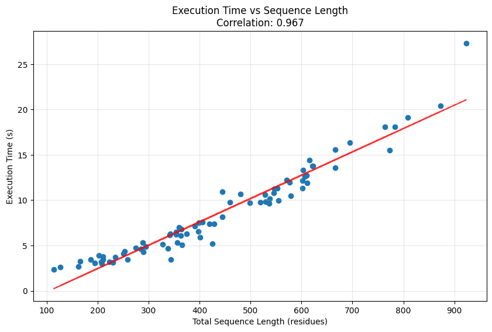
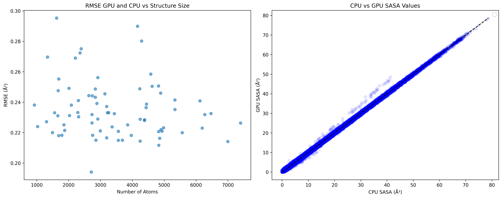

# Bio-Lib

A Python library for analyzing protein interactions, calculating Solvent Accessible Surface Area (SASA), predicting binding affinity (prodigy), and identifying residue contacts in JAX.

## Installation

```bash
python3 -m pip install --index-url https://test.pypi.org/simple/ --extra-index-url https://pypi.org/simple/ bio_lib==0.9.4
```

## Core Features
- **Input Processing in JAX**: Support for both AlphaFold2 (works) and custom JAX structure processing (in progress).
  - **Residue Classification**: Amino acid categorization (charged, polar, aliphatic) etc.
- **Binding Affinity Prediction in JAX**: ΔG and Kd estimation using interface contacts and surface properties, customized [PRODIGY](https://github.com/haddocking/prodigy):
  - **SASA Calculation**: JAX-based implementation of Shrake-Rupley algorithm for solvent-accessible surface area calculation (Tested on L4 GPU <1000 sequence length)
  - **Contact Analysis**: Distance-based residue-residue contact determination within protein complexes

## Comparison with Original Prodigy Results

```bash
run-prodigy-custom PRODIGYdataset/ --use-jax # otherwise default is cpu version
```

| **Metric**                     | **Pearson r** | **RMSE**  |
|---------------------------------|---------------|-----------|
| Binding Affinity               | 1.000         | 0.040     |
| Charged-Charged contacts       | 1.000         | 0.000     |
| Charged-Polar contacts         | 1.000         | 0.000     |
| Aliphatic-Charged contacts     | 1.000         | 0.000     |
| Polar-Polar contacts           | 1.000         | 0.000     |
| Aliphatic-Polar contacts       | 1.000         | 0.000     |
| Aliphatic-Aliphatic contacts   | 1.000         | 0.000     |
| NIS Polar                      | 1.000         | 0.167     |
| NIS Aliphatic                  | 0.999         | 0.207     |
| NIS Charged                    | 1.000         | 0.139     |

### Tested on a L4 GPU in Colab (run-prodigy-custom --use-jax)



### SASA Values comparisons between freesasa (cpu version) and jax version (1000 Poitns)


## Usage Example

```python
# Process single structure
from bio_lib import run_prodigy_jax
results = run_prodigy_jax.run("complex.pdb", "A", "B")
print(results)

# Process directory of structures with timing
results = run_prodigy_jax.run(
  "path/to/pdbs/",
  target_chain="A",
  binder_chain="B",
  use_jax_class=False  # Toggle between JAX/AlphaFold2 processing
)
```

For more detailed examples, check out [test.ipynb](test.ipynb).
