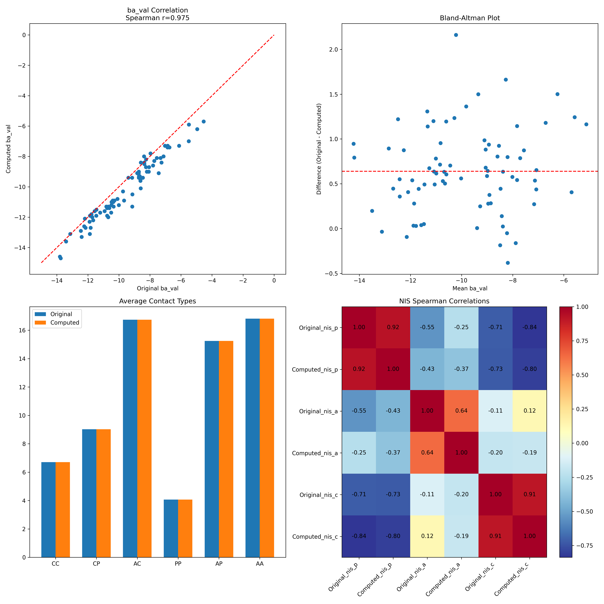

# Bio-Lib

A Python library for analyzing protein interactions, calculating Solvent Accessible Surface Area (SASA), predicting binding affinity (prodigy), and identifying residue contacts in JAX. 

## Installation

```bash
!python3 -m pip install --index-url https://test.pypi.org/simple/ --extra-index-url https://pypi.org/simple/ bio_lib==0.4.0
```

## Core Features

- **SASA Calculation**: JAX-based implementation of Shrake-Rupley algorithm for solvent-accessible surface area calculation
- **Contact Analysis**: Distance-based residue-residue contact determination within protein complexes
- **Binding Affinity Prediction**: ΔG and Kd estimation using interface contacts and surface properties, customized [PRODIGY](https://github.com/haddocking/prodigy)
- **Residue Classification**: Amino acid categorization (charged, polar, aliphatic) etc.

## Benchmark Results




## Usage
from bio_lib import run_prodigy_jax
```
results = run_prodigy_jax.run("complex.pdb", "A", "B")
print(results)
```
### Command Line Interface

```bash
python run_prodigy_jax.py structure.pdb A B \
  --cutoff 5.5 \
  --acc_threshold 0.05 \
  --output-dir ./results \
  --format json
```

#### Or
```
run-prodigy-jax complex.pdb A B --format human --format json
```

#### CLI Arguments
```
- `pdb_path`: Path to PDB file
- `target_chain`: Target protein chain ID
- `binder_chain`: Binder protein chain ID
- `--cutoff`: Contact distance cutoff (Å, default: 5.5)
- `--acc_threshold`: SASA threshold (default: 0.05)
- `--output-dir`: Output directory (default: ./results)
- `--format`: Output format [json|human|both] (default: both)
```
